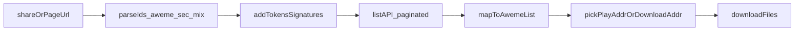

# Kotlin 模仿 F2 做批量下载：前置条件与步骤清单

本文对应思路与 [Johnserf-Seed/f2](https://github.com/Johnserf-Seed/f2) 文档中的 DouYin 模块一致：**不依赖页面 RENDER_DATA**，而是**走 Web/API 数据接口**（JSON 里含 `aweme_id`、封面、`play_addr` 等），并保持请求可被服务端接受。

---

## 1. 先定「批量」的业务范围（影响是否需要登录）

F2 文档用「账号状态」区分能力（见 README 中 DouYin 表格）：

- **游客可拉取的公开页**：例如他人主页公开作品列表、公开合集、部分「喜欢/收藏夹」页面若对游客可见则也可拉；**权限以实际接口返回为准**。
- **必须登录 Cookie 才能拉取**：例如「仅自己可见」、自己的收藏/点赞列表、部分个性化内容等。

**Kotlin 实施前要决策**：列表 Tab 只支持「公开合集/主页」还是也要支持「我的喜欢/收藏」；后者必须做 **Cookie 注入 + 账号合规提示**。

---

## 2. 链接与资源 ID：批量前的「解析层」

从用户粘贴的 URL（短链、分享文案中的链接、`www.douyin.com/video/...`、合集页等）解析出**后续列表接口需要的 ID**（F2 里对应各类 Fetcher 概念）：

| 概念                        | 典型出现位置          | 用途           |
| ------------------------- | --------------- | ------------ |
| `aweme_id` / `awemeId`    | 单视频链接、列表项       | 单条作品唯一标识     |
| `sec_user_id`             | 用户主页 URL、部分接口参数 | 拉「用户发布作品列表」等 |
| `mix_id` / 合集 ID          | 合集页链接           | 拉「合集中视频列表」   |
| `cursor` / `max_cursor` 等 | 来自上一次列表响应       | **翻页**（批量核心） |

**前置步骤**：实现「短链 302 → 落地页」、`video/(\d+)` / 合集参数等正则或一次轻量请求，把**稳定 ID**存下来再调列表 API。

---

## 3. Cookie / Token / 设备指纹类参数（请求合法性）

抖音 Web 请求常见依赖（名称以 F2 文档与社区实现为参照，**实际键名与是否必填会随版本变化**）：

**Cookie 常见键（视接口与场景）**

- `msToken`：Web 侧常见票据之一；F2 提供「真实/虚假」生成相关能力说明（见你引用的 README：`TokenManager`）。
- `ttwid`：访客/会话标识；F2 文档列为可生成项。
- `odin_tt`、`sessionid`、`sessionid_ss`、`sid_guard` 等：**登录态**下更完整；游客可能仅需子集。
- 反爬相关：`__ac_signature`、`__ac_nonce`、`__ac_referer` 等：若走**纯 OkHttp 调桌面接口**，往往需要复现或绕过；**若用 WebView 先打开 douyin.com 再读 `CookieManager`**，可与浏览器一致（这是你单视频 WebView 路线上「Cookie 引导」的思路）。

**Query / Header 里常出现的「指纹类」参数（F2 README 工具表）**

- `verify_fp` / `s_v_web_id`（或同类）：设备/浏览器指纹相关。
- `webid` / `uifid` 等：接口或页面初始化阶段下发或推导。
- `User-Agent`：**必须与签名算法假设一致**（F2 强调 UA 与 `XBogus`/`ab` 参数匹配）。

**Kotlin 侧前置动作小结**

1. 定一种 **Cookie 来源**：纯算法生成部分 token、或 **WebView 预热域名后同步 Cookie**、或用户手动粘贴 Cookie（运维成本高）。
2. 维护一套 **可刷新** 机制：Cookie 失效、419/403 时要重签或重新引导 WebView。

---

## 4. 接口签名：X-Bogus / a_bogus（ab）等

F2 对抖音 Web 请求的重要部分是：**在 URL 或 body 上附加签名参数**，否则接口返回空包或直接拒绝。

- `XBogusManager`：`X-Bogus`（或同类 query 签名）。
- `ABogusManager` / `ab` 算法：**较新 Web 接口常要求** `a_bogus`（README 中写为默认使用 ab 等）。

**Kotlin 模仿的前置条件**

- 要么 **移植/ JNI 调用** 与 F2 同源的签名实现（注意 Apache-2.0 许可证与版权说明）。
- 要么 **服务端代理**（由 Python F2 或自研服务算签名，App 只调你的后端）——架构不同，但可降低 App 内逆向维护成本。

**关键点**：签名输入通常包含 **完整 URL（含已有 query 排序）**、**UA**、**post body**、有时钟/随机种子；版本升级后算法会变，需要**可更新渠道**。

---

## 5. HTTP 层：固定请求头与环境

除 Cookie 外，通常还需要与浏览器接近的头（具体以抓包为准）：

- `Referer`：`https://www.douyin.com/` 或具体视频/用户页 URL。
- `Origin`：`https://www.douyin.com`（POST/部分 GET）。
- `Accept` / `Accept-Language`（中文环境）。
- 部分接口需要 `x-secsdk-csrf-token` 等（若出现，需从页面或前置接口拿）。

**前置**：在 Kotlin 里封装 `DouyinWebClient`，统一注入 UA、Cookie、Referer，并在 **每次列表请求前** 拼好带签名的 URL。

---

## 6. 批量下载的主流程（与 F2 一致的数据管道）

**步骤细化**

1. **解析入口 URL** → `sec_user_id` / `mix_id` / 或直接从分享解析出初始游标。
2. **准备 Cookie + 指纹参数**（见第 3 节）。
3. **调用列表接口**（F2 中如主页作品、合集作品、点赞、收藏夹等对应不同 endpoint 与参数）。
4. **解析 JSON**：取出每条 `aweme` 的 `aweme_id`、`desc`、`video.cover`、`video.play_addr`（或 `download_addr` 等字段）；注意 **水印/清晰度** 字段差异。
5. **翻页**：读取响应里的 `cursor` / `has_more` 等，循环直到无更多或达到上限。
6. **下载**：对每条 URL 用 `DownloadManager` 或你已实现的流式写入；需处理 302、CDN 鉴权头。

---

## 7. 与当前 App 的衔接（你保留单视频 Tab）

- **单视频 Tab**：继续 WebView + `shouldInterceptRequest`（你已验证）不动。
- **列表 Tab**：建议 **两条路二选一或组合**：
  - **A. 纯 API**：按上文的 Cookie + 签名 + 分页（工程量大，行为最接近 F2）。
  - **B. WebView 辅助**：只用电 WebView **刷 Cookie / uifid**，真正列表仍走 OkHttp（减少部分反爬阻力，但签名仍要）。
  - **C. 仅展示 + 降级**：列表数据从「公开页面 JSON 嵌入」解析（脆弱），或只对单链批量打开 WebView（慢）。

当前 `[ListDownloadFragment.kt](d:\workplace\BlitzDownloader\app\src\main\java\com\blitz\downloader\ui\ListDownloadFragment.kt)` 已有 WebView 占位；若走 A/B，需要新增 **Repository 层**（不放在 Fragment 里拼签名）。

---

## 8. 合规与维护预期（实施前就要写进 README/设置）

- 遵守平台服务条款与用户授权；批量抓取可能触发频率限制；需 **限速、重试、错误提示**。
- 签名与接口变更会**突然失效**，要有版本更新与降级文案（例如引导使用单视频 WebView）。

---

## 9. 建议的 Kotlin 模块拆分（实施时文件级准备）

| 模块                         | 职责                                        |
| -------------------------- | ----------------------------------------- |
| `DouyinUrlParser`          | 短链展开、提取 `aweme_id`/`sec_user_id`/`mix_id` |
| `DouyinCookieStore`        | 持久化/刷新 Cookie，可选 WebView 引导               |
| `DouyinSigner`             | X-Bogus / a_bogus（或远程签名服务适配器）             |
| `DouyinListApi`            | 各列表 endpoint + 分页                         |
| `AwemeMapper`              | DTO → `VideoItemUiModel` / 下载 URL         |
| `BatchDownloadCoordinator` | 勾选队列、并发、写 Download 目录                     |

---

以上即为在 Kotlin 侧「模仿 F2」做批量下载前，需要逐项就绪的 **参数类前置**与 **流程类步骤**；其中 **Cookie/指纹 + 签名 + 分页列表 API** 是三条硬门槛，与 F2 Python 实现同源问题，只是语言与运行环境换成了 Android。